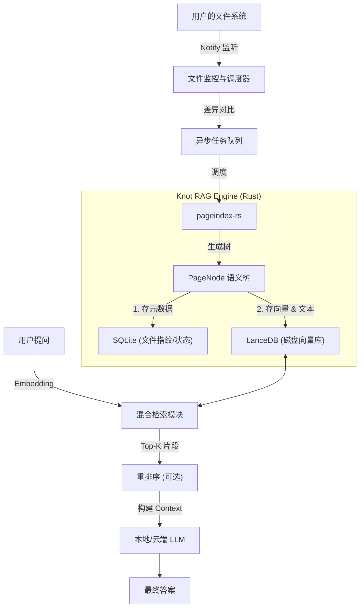

这是一个非常典型的 **Local-First RAG (本地检索增强生成)** 场景。基于你已经构建的 `pageindex-rs`，你已经解决最难的“非结构化数据转结构化语义树”的问题。

针对你的 **“万级文档、本地运行、实时同步、极速响应”** 需求，普通的内存向量库（如 HNSW 在内存中）会导致普通电脑内存爆炸。因此，我们需要设计一套 **基于磁盘的高性能架构**。

以下是基于 Rust 生态的 **Knot RAG 引擎架构方案**：

---

### 核心架构图



---

### 方案详解

#### 1. 存储层选型：LanceDB (关键决策)

**需求对应：** 3 (万级文档性能), 7 (普通电脑运行)

对于本地 App，不要用 Qdrant/Milvus 服务端，太重。也不要单纯用内存 HNSW，内存会爆。
推荐使用 **[LanceDB](https://github.com/lancedb/lancedb)**。

* **Rust 原生**：与你的项目完美兼容。
* **磁盘原生 (Disk-based)**：向量和数据存储在磁盘（`.lance` 文件），**不占用 RAM**，查询速度依然极快。
* **零拷贝**：读取数据极快。
* **多模态**：可以直接存储文本、Metadata 和 Vector。

#### 2. 文件监控与增量更新 (The Watcher)

**需求对应：** 1 (自动扫描), 2 (文件变更自动生成)

我们需要一个 **"文件状态数据库" (File State DB)**，通常使用 SQLite。

**SQLite 表结构 (`file_registry`)：**

```sql
CREATE TABLE file_registry (
    file_path TEXT PRIMARY KEY,
    last_modified INTEGER,
    content_hash TEXT, --文件的指纹 (Blake3/SHA256)
    parse_status TEXT, -- 'indexed', 'failed', 'pending'
    indexed_at INTEGER
);

```

**逻辑流程：**

1. **启动时**：使用 `walkdir` 遍历目录。
2. **运行时**：使用 `notify` crate 监听文件变更事件 (Create, Write, Delete, Rename)。
3. **防抖 (Debounce)**：用户狂按 Ctrl+S 时，只在最后一次操作后 2秒触发索引。
4. **增量检查**：
* 计算当前文件的 Hash。
* 如果 `Hash == SQLite.content_hash`，跳过（即使修改时间变了，内容没变也不重算）。
* 如果不同，调用 `pageindex-rs` 重新生成，并**覆盖** LanceDB 中该文件的旧数据。


#### 3. 索引策略：如何拆解 `PageNode` 树？

**需求对应：** 4 (快速得到结果), 5 (准确性)

`PageNode` 是树，RAG 需要的是“块 (Chunks)”。我们利用树的结构优势来做 **"父子索引 (Parent-Child Indexing)"**。

**写入 LanceDB 的策略：**
不只是把叶子节点存进去，而是存 **"路径增强的文本"**。

```rust
// 存入 LanceDB 的结构
struct VectorRecord {
    id: String,           // Node ID
    file_path: String,
    vector: Vec<f32>,     // 节点的 Embedding
    text: String,         // 节点的 Content
    
    // 关键：利用 pageindex-rs 的树结构增强上下文
    breadcrumbs: String,  // 如 "用户手册 > 第3章 > 故障排除"
    root_summary: String, // 根节点的摘要 (如果有)
    level: u32,
    score: f32,           // 预留给搜索结果
}

```

* **叶子节点 (Leaf Nodes)**：必须存。这是最细节的信息。
* **中层节点 (Section Nodes)**：如果 Token 数适中，也存。
* **Context Injection**：在存入向量库之前，将 `breadcrumbs` (面包屑导航)拼接到 `text` 前面。这样 LLM 知道这段话属于哪个章节，极大提高准确率。

#### 4. 检索与生成 (Retrieval & Generation)

**需求对应：** 5 (准确不乱说), 6 (回答快), 8 (显示分数出处)

**步骤 A: 混合检索 (Hybrid Search)**
单靠向量搜索有时候搜不到专有名词（如具体的错误码）。

* **Vector Search**: LanceDB 提供。
* **Full-Text Search (FTS)**: Tantivy (Rust 的 Lucene) 或者 LanceDB 自带的 FTS 功能。
* **策略**: `Final_Score = (Vector_Score * 0.7) + (Keyword_Score * 0.3)`

**步骤 B: 结果重排序 (Rerank) - *提升准确率的关键***
向量搜索出来的 Top 50 可能包含很多似是而非的内容。

* 在本地引入一个极轻量的 **Cross-Encoder** (如 `bge-reranker-v2-m3` 的量化版)。
* 对 Top 50 进行打分，取 Top 5 给 LLM。
* **如果 Top 1 的分数低于某个阈值（例如 0.6），直接回答“未找到相关信息”，防止幻觉。**

**步骤 C: 构建 Prompt**

```text
你是一个专业的知识库助手。请根据以下参考文档回答问题。
如果参考文档中没有答案，请直接说“我无法在现有文档中找到答案”。不要编造信息。

参考文档：
[1] (匹配度: 98%) 文件: {path} - 章节: {breadcrumbs}
内容: {content}

[2] (匹配度: 85%) ...

用户问题: {query}

```

---

### Rust 实现概览 (伪代码)

#### 1. 定义依赖

```toml
[dependencies]
pageindex-rs = { path = "../pageindex-rs" }
lancedb = "0.4" 
arrow_array = "50.0"
tokio = { version = "1", features = ["full"] }
notify = "6.0"
rusqlite = "0.29"
sqlx = { version = "0.7", features = ["sqlite", "runtime-tokio"] }
anyhow = "1.0"

```

#### 2. 实现文件扫描与调度 (Indexer)

```rust
use pageindex_rs::{IndexDispatcher, PageIndexConfig};
use notify::{Watcher, RecursiveMode, RecommendedWatcher};

struct KnotIndexer {
    dispatcher: IndexDispatcher,
    db_pool: sqlx::SqlitePool, // 存放文件指纹
    lance_table: lancedb::Table,
}

impl KnotIndexer {
    /// 文件变更处理逻辑
    pub async fn handle_file_event(&self, path: PathBuf) -> Result<()> {
        // 1. 检查 Hash，看是否真的变了
        let current_hash = compute_file_hash(&path)?;
        if self.is_file_unchanged(&path, &current_hash).await? {
            return Ok(());
        }

        // 2. 调用 pageindex-rs 解析
        // 这里 vision/llm provider 需传入 Knot 初始化的全局实例
        let config = PageIndexConfig::default(); 
        let tree_root = self.dispatcher.index_file(&path, &config).await?;

        // 3. 扁平化树结构为 Records (Chunks)
        let records = self.flatten_tree_to_records(tree_root, &path);

        // 4. 更新 LanceDB (先删后插，保证数据一致性)
        self.lance_table.delete(&format!("file_path = '{}'", path.display())).await?;
        self.lance_table.add(records).await?;

        // 5. 更新 SQLite 状态
        self.update_file_status(&path, &current_hash).await?;
        
        Ok(())
    }

    /// 将 PageNode 树拍平，带上层级上下文
    fn flatten_tree_to_records(&self, node: PageNode, path: &Path) -> Vec<Record> {
        let mut records = Vec::new();
        // 递归遍历...
        // 关键：将父节点的 title 拼接到子节点作为 context
        // 只有叶子节点或者 token 数够多的节点才生成 Record
        records
    }
}

```

#### 3. 实现检索 (Retriever)

```rust
struct SearchResult {
    content: String,
    file_path: String,
    score: f32,
    breadcrumbs: String,
}

impl KnotRetriever {
    pub async fn query(&self, user_question: &str) -> Result<String> {
        // 1. 生成问题的 Embedding
        let query_vec = self.embedding_provider.generate_embedding(user_question).await?;

        // 2. LanceDB 向量搜索
        let results = self.lance_table
            .search(&query_vec)
            .limit(10)
            .execute()
            .await?;

        // 3. (可选) 本地 Rerank 过滤
        // let top_results = self.reranker.rerank(user_question, results);

        // 4. 组装 Prompt
        let context_str = results.iter().enumerate().map(|(i, r)| {
            format!("[{}] 来源: {} ({})\n内容: {}\n", 
                i+1, r.file_path, r.breadcrumbs, r.content)
        }).collect::<String>();

        let prompt = format!(
            "基于以下上下文回答问题，必须标注引用来源[x]。\n\n上下文:\n{}\n\n问题: {}", 
            context_str, user_question
        );

        // 5. LLM 生成
        self.llm_provider.generate_content(&prompt).await
    }
}

```

---

### 性能优化 Checklist (针对普通电脑)

1. **Lazy Loading (懒加载)**: App 启动时不加载任何模型。只有当用户第一次触发“索引”或“搜索”时才加载 Embedding 模型。
2. **Quantization (量化)**:
* Embedding 模型使用 INT8 或 Q4 量化版 (ONNX Runtime)。
* LLM 使用 GGUF 格式 (4-bit)。


3. **Throttling (节流)**:
* 文件扫描不要占满 CPU。使用 `tokio::semaphore` 限制并发解析的文件数为 `CPU核数 - 2`，保证用户看视频、写代码不卡顿。


4. **Tauri 交互优化**:
* 搜索时，先立刻返回 LanceDB 的搜索结果（由高分到低分排列），界面上显示“正在阅读文档...”，然后再流式输出 LLM 的总结。这样用户感觉不到延迟。


### 总结

这一套方案利用 **`pageindex-rs`** 的结构化能力解决了“垃圾进垃圾出”的问题，利用 **LanceDB** 解决了“海量数据内存爆炸”的问题，利用 **SQLite + Hash** 解决了“文件重复处理”的问题。是一个非常扎实的工程化路径。